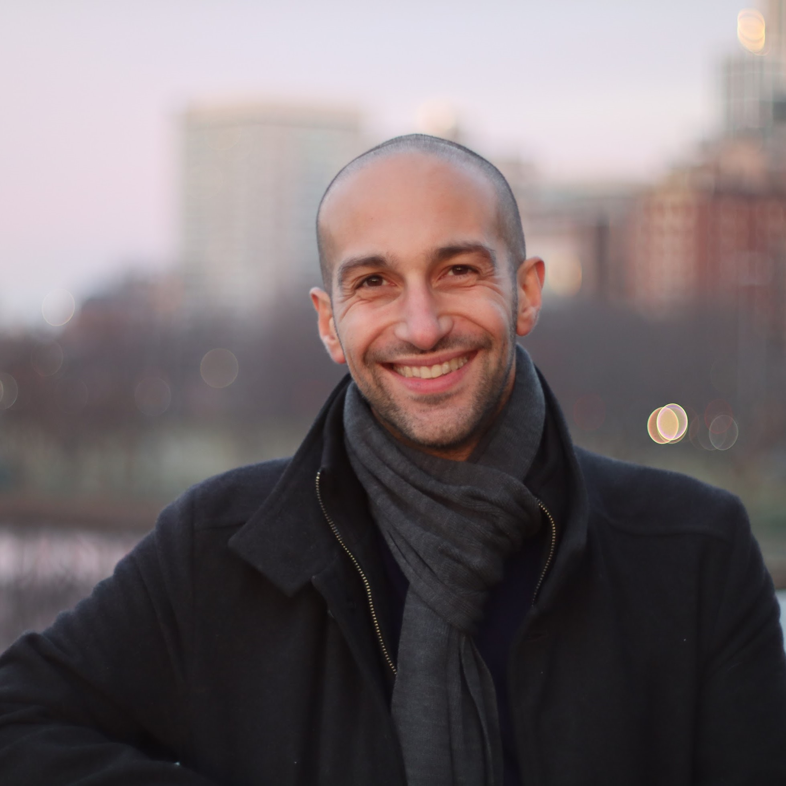
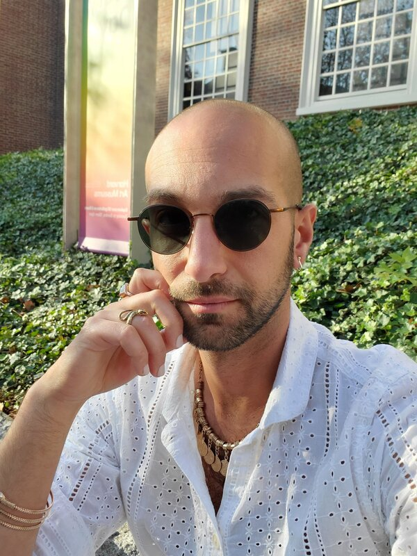
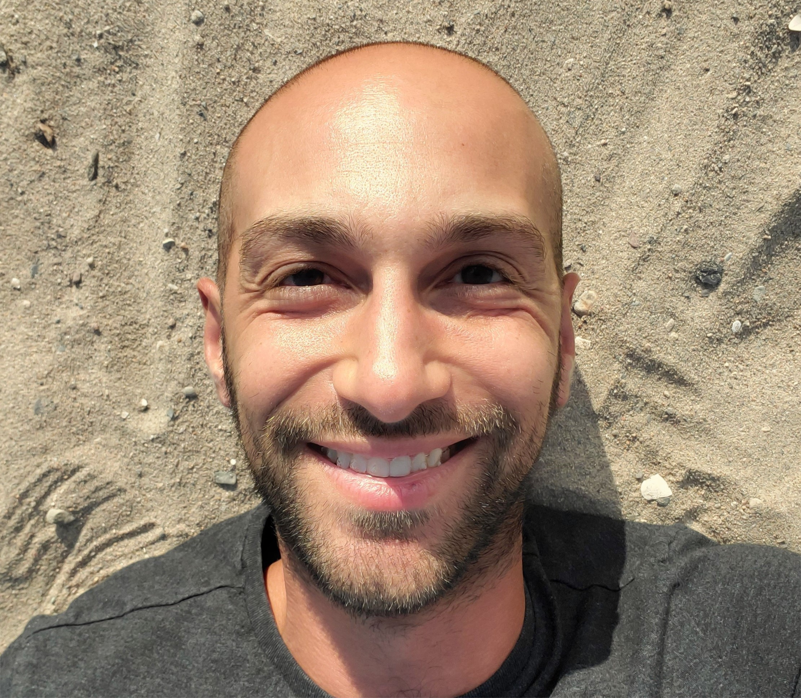

# Hi, I'm Hussein 👋

<section class="splide" aria-label="Splide Basic HTML Example">
  

		<ul class="splide__list">
    <li class="splide__slide"></li>
    <li class="splide__slide"></li>
    <li class="splide__slide"></li>
    <li class="splide__slide"></li>
    </ul>
  

</section>

I'm 38, 5'8", bi, and in pretty good physical shape (the best of my life!). I live in Brooklyn, NYC. I'm playful, reflective, and caring; I'm Uncle Hussein and godparent to two kids I love, I have an amazing cat, I do community work, etc; just a normal, stand-up guy with zero skeletons in the closet and absolutely no aspirations to start a personality cult or anything weird like that.

## The sort of person I am

On bad days I think I'm a good person because I'm funny and clever.  
On good days I think I'm a good person because I'm open-hearted, playful, and kind.  
On the best days I don't think about whether I'm a good person at all.

I recently combined a list of goals and the things I like to do, and they seemed to fall into four values: connection, curiosity, beauty, and vitality.

If you are sick I will make soup and bring it to you. It's an important way I show love.

Some things I like to do:

* Outdoorsy / light-active stuff: climbing, walking, fair-weather sailing, easy cycling (no lycra);
* Growing food - I built raised beds in my garden, and love the fresh tomatoes I get from it;
* DIY and making stuff - I've made plenty of the things in my house, including furniture and drapery;
* Cooking, restaurants, cocktails (though I rarely drink these days);
* Any classical music concert featuring an angsty Russian Romantic composer;
* Self-expression things: dance, finally taking singing lessons.

I worked in tech for 15+ years and one thing it is easy to do is separate oneself from people unlike you. To work and live and play in communities of people very similar to you, or to have the "diversity" you experience look like skin color and sexuality and gender id but not wealth or class or education. It is deeply, vitally important to me to _not_ do this, to stay connected to and in touch and aware of the way others live. We may be better off but we are not better. I will not separate myself from humanity.

My vice is hookah. If I had one at home I'd instantly die of lung cancer, so I don't. But I keep finding that the best people I know are down to go to a hookah bar. Doesn't have to be you, but it's an easy way to get a 🤩 face from me.

I want one of these. This one is someone else's, but I love her anyway.

## The sort of future I want

I believe a life of weeping-with-happiness contentment is possible, and I want it.  
[Update: since writing that, I have wept with happiness.]

I would like to co-create a life - location, partner, friends, community (which I see as another word for "family") - at a more sustainable pace, where exploration and flourishing is nurtured. I value making sure people are fed: I've volunteered making meals for chronically sick people, and also helped run a mutual aid food drive for two years. I want to spend more of my time tackling food insecurity and I've got Big Plans to do so.

I've still got more travelling in me: more time in Japan, interior China, a return to Istanbul, and Iran are all on my bucket list. I seem to be converging on India from both directions.

Someone giving me feedback on this page once told me I come across as having main character energy. It's true! And I'm looking for a co-star: someone who burns brightly, knows it, and wants to be with me because they love my light; a relationship where we reinforce and lift each other, ever-growing.

I think I'd make an amazing trophy husband, which is only a joke if you're not rich.

I want children, and I want to be active in raising them. I grew up in London and miss it enormously, but it's not time for me to move back _yet_; but I do think it'd be a wonderful place to live it's time for me to trade my main character energy into being a supporting character in my kids' lives. If we get serious, expect me to seriously float this idea. In the meantime, I'll be back for regular visits: London is a place where I breathe out, find ease and peace.

## Spirituality

I used to be allergic to the word until a friend pointed out "dude, you have a spirit, it's the thing that makes you you", and then I was fine.

The condensed version of my spiritual biography: I grew up Muslim, but quit in my early twenties because I felt like I couldn't do it well enough. I came close to falling down the New Atheism rabbithole, but dodged it; in my late twenties I began a quest for capital-M Meaning, which I finally found after lots of therapy and years of Zen practice.

Buddhism has been important to me for approaching a decade. Buddhist philosophy and psychology is very much a part of who I am, how I think, and how I like to relate to the world. An example: when getting US citizenship, I asked for a waiver to the Oath of Allegiance on the grounds of not wanting to support the military, even though being 38 means there's basically no chance I'll get drafted.

It's important to me that my partner has their own self-development practice - something that helps them be freer, kinder, and more open. It by no means has to be Buddhist flavoured.

## Potential dealbreakers

I'm happy to talk about any of these if you'd like to know more.

* I would like to have children (at least one), preferably biological.
* The kind of relationship I want is rock-solid: lots of communication, exquisite attunement. I think such a relationship could unfold into something monogam<i>ish</i>: if there is nothing that can threaten the relationship, there's room for fun and sparkles. But to say that the relationship needs to feel very secure first is an understatement; getting that right is the only priority.
* I pair better with someone who also has good executive function skills. Being able to trust a partner to get things done makes me feel taken care of, and gives me a profound feeling of relief and safety.
* I am politically far to the left. That said, I have largely disengaged with US politics and treat it solely as a spectacle. These days I am more of an anarchist, by which I mean I believe that community building and mutual aid is worthwhile and morally necessary.
* If you think Israel's occupation and treatment of Palestine is in any way conscionable or justifiable, I am not the person for you.
* I'm an only child, and have minimal to no contact with both of my parents. My family is thus entirely chosen. If you're close to yours, I would love to become part of it.
* I have [a (really, really, really amazing) cat](../cat). If you viscerally hate cats, or have overwhelming allergies, that'd make it hard.
* I am vegetarian, with very occasional and intentional exceptions. I don't mind whether you are or not. I do enjoy cooking, and will want to cook for you, so if you'll feel slighted by me not putting meat on your plate then… eh, I dunno.

## What next?

This is the end of the text-heavy part. Thank you for sticking around!

There are a few places you can go from here:

* Look at [pictures of my cat](../cat)
* Look at [an assortment of pictures and videos from my life](../moodboard)
* If you're interested, or have something to say, email me: `hello@thiswebsite`

Thanks, and I hope you find what you're looking for too. ❤
