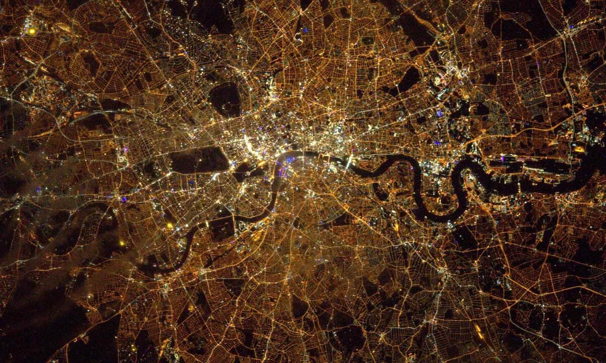

# Hi, I'm Hussein 👋

\[carousel goes here\]

I'm 38, 5'8", and I live in Boston, MA. I'm playful, reflective, and caring; I'm a Buddhist, I have an amazing cat, I'm a godparent and honorary uncle to two kids I love, I do community work, etc; just a normal, stand-up guy with no skeletons in the closet and absolutely no aspirations to start a personality cult.

There are two things I'm working on right now that are very important to me:

1. Living in a city I love;
2. Finding a life partner.

For the first: I've lived in Boston for 11 years, and have lately come to accept that it's not the place for me. I grew up in London and there's something about living in a _very_ big city that makes me feel energized and alive. I'm fortunate enough to be financially secure, so it's time to make that happen.

So: **unless someone changes my mind, I'm moving back to London around June 2025**.

Which means that finding a life partner is most likely going to happen one of two ways:

<table style="width: 100%; table-layout: fixed;">
  <tr>
    <td style="vertical-align: middle; text-align: center; font-weight: bold; font-size: 150%;">
      
    </td>
    <td style="vertical-align: middle; text-align: center; font-weight: bold; font-size: 150%;">
      
    </td>
  </tr>
  <tr>
    <td>
        
In short, <b>I'm willing to change my plans for the right person</b>. I <i>do</i> want to live in a big city, but as long as the energy is right, that could be any number of places. London and NYC are the obvious ones, but there might be others: Chicago? Paris? Tokyo?

        
I realize that "embark on a relationship knowing you have a few months in which to materially affect a big life decision" is daunting, and I don't blame anyone who doesn't want to take that on.

        
But if you think we're compatible and are willing to give it a shot...

    </td>
    <td>
        
You live in or around London; or you're London-curious and could imagine potentially making it home.

        
I will be visiting to figure out logistics a few times before I move, so there'll be opportunities to meet up then.

    </td>
  </tr>
</table>

As you can see, I'm the sort of person who gets down to brass tacks quickly. Let's continue that streak:

## Potential dealbreakers

I'm happy to talk about any of these if you'd like to know more.

* I would like to have children (at least one), biological if possible.
* I am open to a <u>very</u> secure relationship unfolding into something monogam<i>ish</i>, if it feels right. The thing I really care about is the "very secure relationship" part: I think a relationship with good grounding, and the right effort and intention, will become whatever it should.
* I pair better with someone who also has good executive function skills. Being able to trust a partner to get things done makes me feel taken care of, and gives me a profound feeling of relief and safety.
* I am politically far to the left. That said, I have largely disengaged with US politics and treat it solely as a spectacle. These days I am more of an anarchist, by which I mean I believe that community building and mutual aid is worthwhile and morally necessary. I feel a particular calling to make sure people have food.
* If you think Israel's occupation and treatment of Palestine is in any way conscionable or justifiable, I am not the person for you.
* I am Buddhist-aligned. Which particular flavour I identify with, my practice, and my relationship to it have all evolved over time, and I expect that to continue, but the Buddhist perspective is an important part of my worldview (see <a href="#spirituality">Spirituality</a>). My ideal person has some sort of spiritual / contemplative practice that they're similarly dedicated to.
* I'm an only child, and have minimal to no contact with both of my parents. My family is thus entirely chosen. If you're close to yours, I would love to become part of it.
* I have [a (really, really, really amazing) cat](../cat). If you viscerally hate cats, or have overwhelming allergies, that'd make it hard.
* I am vegetarian, with very occasional and intentional exceptions. I don't mind whether you are or not. I do enjoy cooking, and will want to cook for you, so if you'll feel slighted by me not putting meat on your plate then… eh, I dunno.

## The sort of person I am

On bad days I think I'm a good person because I'm funny and clever.  
On good days I think I'm a good person because I'm open-hearted, playful, and kind.  
On the best days I don't think about whether I'm a good person at all.

I think this captures me well: I built raised beds in my garden. I like tending to it over the summer and then getting to enjoy incredible tomatoes at the end of the season. (I thought tomatoes were meh until I pulled one directly off the plant.)

If you are sick I will make soup and bring it to you. It's an important way I show love.

Some things I like to do:

* Outdoorsy / light-active stuff: climbing, walking, fair-weather sailing, easy cycling (no lycra).
* DIY and making stuff - I've made plenty of the things in my house, including drapery.
* Cooking, restaurants, cocktails (though I rarely drink these days).
* Any classical music concert featuring an angsty Russian Romantic composer.
* I am kinda getting into energy woo lately??? Chakras??? I am but a baby but there is something going on here.
* I am, finally, taking singing lessons! Which feels great.

I have worked in tech for 15+ years and one thing it is easy to do is separate oneself from people unlike you. To work and live and play in communities of people very similar to you, or to have the "diversity" you experience look like skin color and sexuality and gender id but not wealth or class or education. It is deeply, vitally important to me to _not_ do this, to stay connected to and in touch and aware of the way others live. We may be better off but we are not better. I will not separate myself from humanity.

My vice is hookah. If I had one at home I'd instantly die of lung cancer, and I much prefer living, so I don't. But I keep finding that the best people I know are down to go to a hookah bar. Doesn't have to be you, but it's an easy way to get a 🤩 face from me.

## The sort of future I want

I believe a life of weeping-with-happiness contentment is possible, and I want it.  
[Update: since writing that, I have indeed wept with happiness.]

I would like to co-create a life - location, partner, friends, community (which I see as another word for "family") - at a more sustainable pace, where exploration and flourishing is nurtured. I value making sure people are fed: I've volunteered making meals for chronically sick people, and also helped run a mutual aid food drive for two years. I want to spend more of my time tackling food insecurity and I've got Big Plans to do so.

I'd like to have kids, and be active in raising them. I often joke that I'd make an amazing trophy husband. Meanwhile, I've still got more travelling in me: more time in Japan, interior China, a return to Istanbul, and Iran are all on my bucket list. I think I'm sorta converging on India from both directions.

## Spirituality

I used to be allergic to the word until a friend pointed out "dude, you have a spirit, it's the thing that makes you you", and then I was fine.

The condensed version of my spiritual biography: I grew up Muslim, but quit in my early twenties because I felt like I couldn't do it well enough. I came close to falling down the New Atheism rabbithole, but dodged it; in my late twenties I began a quest for capital-M Meaning which I finally found after lots of therapy and years of Zen practice.

Buddhism has been important to me for approaching a decade. Buddhist philosophy and psychology is very much a part of who I am, how I think, and how I like to relate to the world. An example: when I filed for US citizenship, I asked for a waiver to the Oath of Allegiance on the grounds of not wanting to support the military, even though being 38 means there's basically no chance I'll get drafted.

It's important to me that my partner has their own self-development practice - something that helps them be freer, kinder, and more open. It by no means has to be Buddhist flavoured.

## What next?

This is the end of the text-heavy part. Thank you for sticking around!

There are a few places you can go from here:

* Look at [pictures of my cat](../cat)
* Look at [an assortment of pictures and videos from my life](../moodboard)
* If you're interested, or have something to say, email me: `hello@thiswebsite`

Thanks, and I hope you find what you're looking for too. ❤
